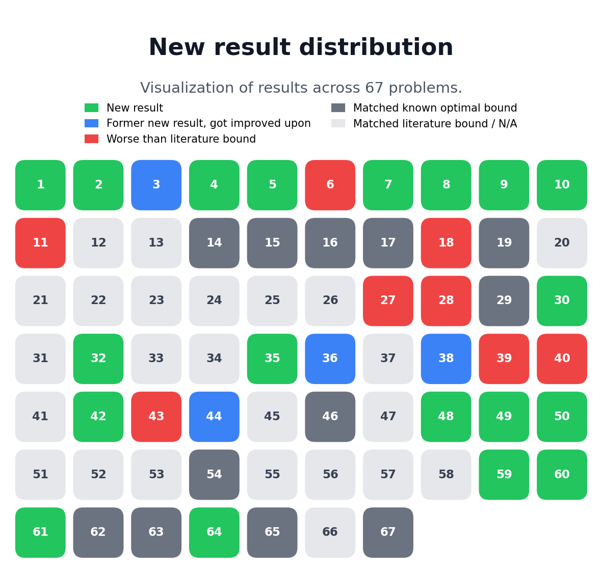

# Mathematical Problem Repository for AlphaEvolve

This repository accompanies the manuscript

> Bogdan Georgiev, Javier Gómez-Serrano, Terence Tao, Adam Zsolt Wagner -- Mathematical exploration and discovery at scale, 2025

which is [available on the arXiv](https://arxiv.org/abs/2511.02864).  Specifically, the repository contains a webpage corresponding to each of the
problems considered in the manuscript, along with multiple Google Colab
notebooks corresponding to many (not all) of the problems. Each notebook
contains the prompt, verification code, and initial program used to launch the
AlphaEvolve experiments, along with the final evolved programs and
visualization / analysis code where appropriate.

This repository does *not* contain the code to run AlphaEvolve.

## A Collection of Mathematical Problems

The repository currently contains 67 mathematical problems whose descriptions
are available in the problems directory.

The n-th problem in the collection is available at:

https://google-deepmind.github.io/alphaevolve_repository_of_problems/problems/{n}.html

E.g. an autocorrelation problem related to Sidon sets (Problem 2) is:

https://google-deepmind.github.io/alphaevolve_repository_of_problems/problems/2.html

## Distribution of Results

The current problem status is summarized in the following graphic:



## Feedback

Comments are most welcome - please feel free to contact the repository owners
or send a pull request.
This is a live repository which we expect to expand and improve over time.

## Installation

No installation required. The provided notebooks can be opened and run in Google
Colab, and the webpages can be opened in any browser.

## Usage

The notebooks can be opened via
[](https://colab.research.google.com/).

## Citing this work

If you use the code or data in this package, please cite:

```
@article{alphaevolve,
      title={Mathematical exploration and discovery at scale},
      author={Georgiev, Bogdan and G\'omez-Serrano, Javier and Tao, Terence and Wagner, Adam Zsolt},
      year={2025},
      journal={arXiv preprint arXiv:2511.02864}
}
```

## Additional links

- "[Mathematical exploration and discovery at scale](https://terrytao.wordpress.com/2025/11/05/mathematical-exploration-and-discovery-at-scale/)", Terence Tao, 5 Nov 2025.

## License and disclaimer

Copyright 2025 Google LLC

All software is licensed under the Apache License, Version 2.0 (Apache 2.0);
you may not use this file except in compliance with the Apache 2.0 license.
You may obtain a copy of the Apache 2.0 license at:
https://www.apache.org/licenses/LICENSE-2.0

All other materials are licensed under the Creative Commons Attribution 4.0
International License (CC-BY). You may obtain a copy of the CC-BY license at:
https://creativecommons.org/licenses/by/4.0/legalcode

In this work Professor Javier Gómez-Serrano (Brown University) and Professor
Terence Tao (University of California, Los Angeles) have provided supervision,
problem selection, review, analysis and commentary.

Problem 65 originates from https://www.imo-official.org/problems.aspx, which is
the official website of the IMO.

Unless required by applicable law or agreed to in writing, all software and
materials distributed here under the Apache 2.0 or CC-BY licenses are
distributed on an "AS IS" BASIS, WITHOUT WARRANTIES OR CONDITIONS OF ANY KIND,
either express or implied. See the licenses for the specific language governing
permissions and limitations under those licenses.

This is not an official Google product.

